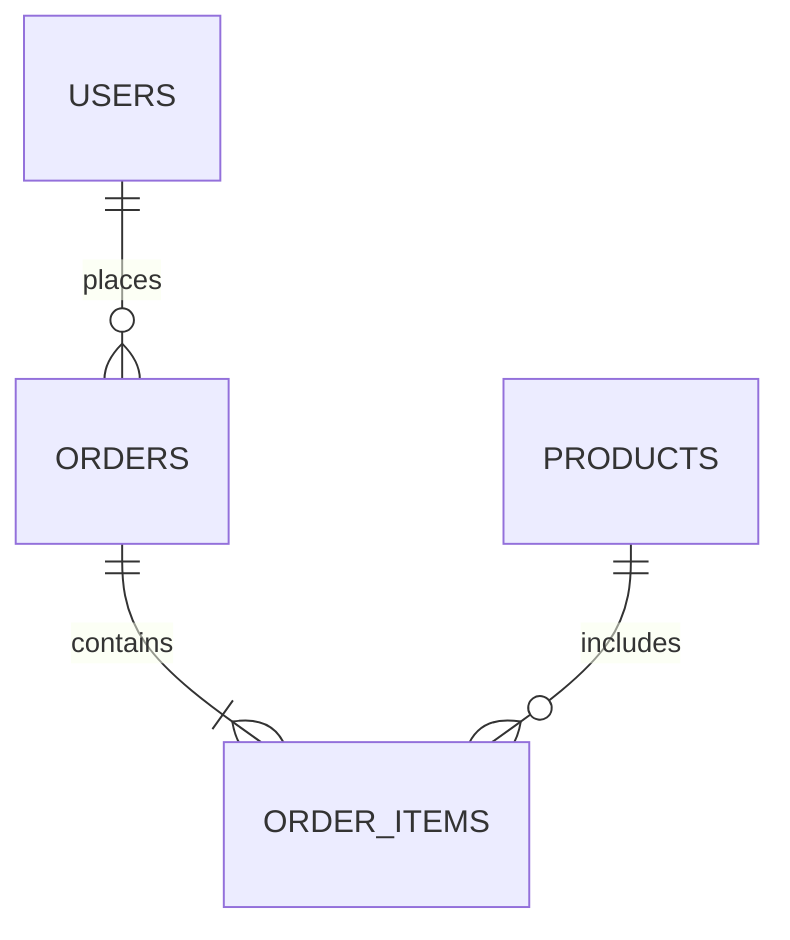

# 数据库设计文档

## 概述
本文档详细说明了项目的数据库设计，包括表结构、关系模型、索引设计等内容。

## 数据库选型
- 数据库类型：关系型数据库
- 具体实现：PostgreSQL 14+
- ORM框架：Prisma

## 表结构设计

### 用户表 (users)
| 字段名 | 类型 | 说明 | 索引 |
|--------|------|------|------|
| id | uuid | 主键 | PRIMARY |
| email | varchar(255) | 用户邮箱 | UNIQUE |
| password | varchar(255) | 加密密码 | - |
| created_at | timestamp | 创建时间 | - |
| updated_at | timestamp | 更新时间 | - |

### 产品表 (products)
| 字段名 | 类型 | 说明 | 索引 |
|--------|------|------|------|
| id | uuid | 主键 | PRIMARY |
| name | varchar(255) | 产品名称 | - |
| price | decimal(10,2) | 价格 | - |
| stock | integer | 库存 | - |
| created_at | timestamp | 创建时间 | - |

## 关系模型


## 索引设计
- users_email_idx：用户表邮箱索引
- products_name_idx：产品表名称索引
- orders_user_id_idx：订单表用户ID索引

## 数据库维护

### 备份策略
- 每日全量备份
- 每小时增量备份
- 保留最近30天的备份

### 性能优化
- 定期VACUUM
- 索引维护
- 查询优化

## 数据迁移
使用Prisma进行数据库迁移：
```bash
# 创建迁移
prisma migrate dev

# 应用迁移
prisma migrate deploy
```

## 更新日志
- 2024-01-03: 初始化数据库文档 